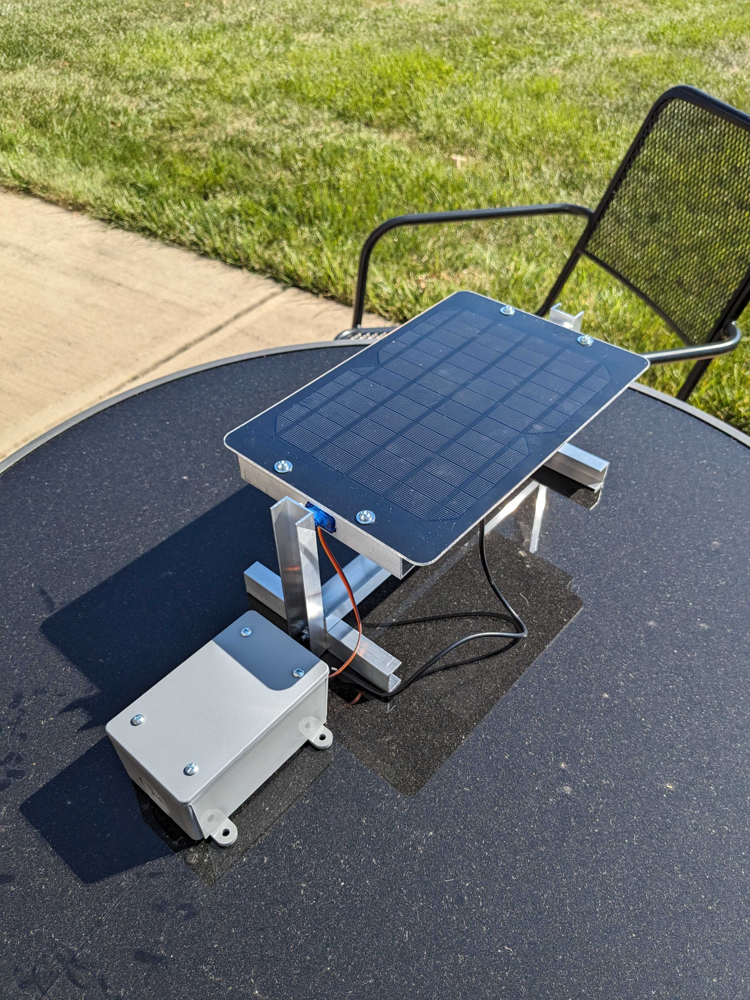
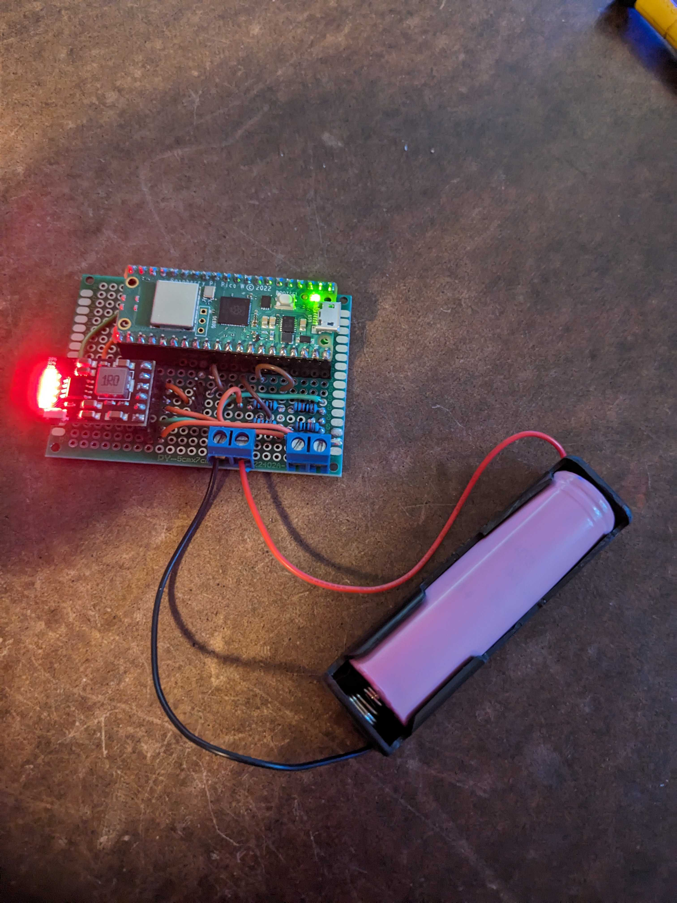
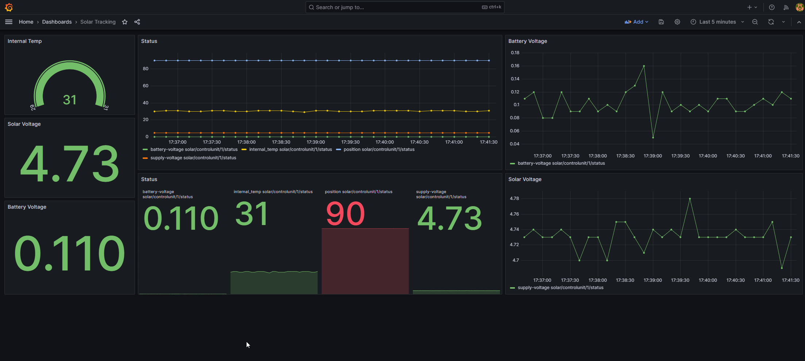

# solar-tracker (WIP)

Playing with solar panels that track the sun's movement for better efficiency.

<div style="display:flex;">
    
    
</div>

## Architecture

* Mosquitto - MQTT broker
* InfluxDB - Time series database
* Grafana - Data visualization

### Hardware

The solar panel controller is a Raspberry Pi Pico that operates continuously off the system's battery. Integrated into the system is a charger module, which is directly connected to the solar panel. This charger module is responsible for managing the power from the solar panel and maintaining the battery at optimal charge levels. One of the primary functions of the controller is to manage a servo mechanism. This servo is mechanically linked to the solar panel, allowing for precise adjustments of the panel's angle in relation to the sun, optimizing the energy absorption throughout the day. Additionally, the controller is tasked with the regular monitoring of various voltages, including supply voltage from the solar panel and the battery voltage, to provide real-time status updates on the system's energy reserves.

### Software

The software aspect of the solar tracker uses MicroPython at it's core. The controller to connects to a Wi-Fi network. Once connected, the controller employs an MQTT client, a lightweight messaging protocol ideal for IoT devices, to publish its status updates. It also subscribes to a specific MQTT topic designed to receive and act upon position commands for the servo, allowing for remote or automated adjustments to the solar panel's orientation.

There is a script that runs on an external server on the network that subscribes to the controller's status updates via MQTT. Upon receipt of new data, the script is responsible for writing this information into an InfluxDB database. This database is designed for the efficient storage of time-series data, offering a robust platform for historical data tracking and analysis.

For visualization and monitoring, Grafana is employed to create a comprehensive dashboard that reflects the overall health and performance of the solar tracker system. This interactive dashboard draws from the data stored in InfluxDB, presenting it in an easily digestible and real-time graphical format.

### Development Considerations

What remains to be developed is a supplementary program that will dynamically calculate the optimal position of the solar panel. This calculation will be based on a variety of parameters, such as the time of day, current weather conditions, and other environmental factors. This predictive control element will enhance the system's efficiency, ensuring that the solar panel maintains the best possible exposure to sunlight under varying conditions.


## MQTT

The payload from the controller

```json
{
    "position": 90,
    "supply-voltage": 4.73,
    "internal-temp": 31,
    "battery-voltage": 0.09
}
```

## Starting everything up

```bash
# Create volume persistant grafana config
docker volume create solar-tracker-grafana

# Start grafana
docker run --rm -d -p 3000:3000 --name=grafana --volume grafana-storage:/var/lib/grafana grafana/grafana:10.2.0

# Create volume persistant grafana config
docker volume create solar-tracker-influxdb

# Start influxdb
docker run --rm -d -p 8086:8086 --name=influxdb --volume solar-tracker-influxdb:/var/lib/influxdb2 influxdb:2.7.3

# Start mosquitto
docker run -d --rm --name mosquitto -p 1883:1883 -p 9001:9001 -v ${PWD}/config/mosquitto.conf:/mosquitto/config/mosquitto.conf eclipse-mosquitto:2.0.18

```

## Grafana Dashboard

